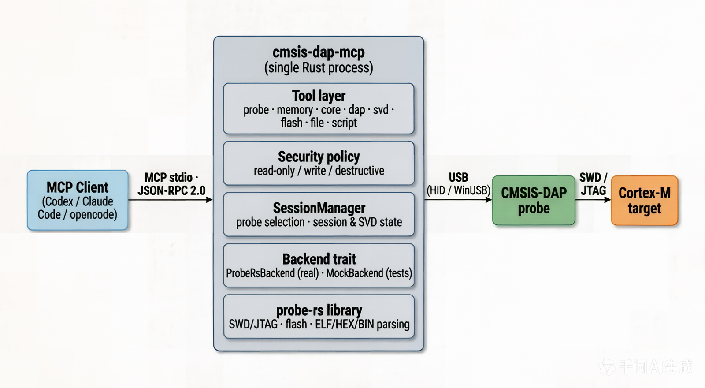

# Architecture

`cmsis-dap-mcp` is a single Rust process that speaks MCP over stdio. It is a
pure server: an MCP client (Codex, Claude Code, opencode, or any MCP-compatible
host) drives it, and it never renders its own UI.

The repository is a Cargo workspace with three crates: `cmsis-dap-core` (the
MCP-independent engine shared by both tools), `cmsis-dap-mcp` (this server)
and `cmsis-dap-cli` (a standalone CLI over the same engine). The diagram below
shows the server side of that workspace.

## System overview



```text
MCP client (Codex / Claude Code / opencode / any MCP host)
    |
    |  MCP stdio: JSON-RPC 2.0, newline-delimited, on stdout
    v
+--------------------------------------------------------------+
|  cmsis-dap-mcp (single Rust process, logs only to stderr)     |
|                                                              |
|  +--------------------------------------------------------+  |
|  | MCP tool layer (rmcp)                                   |  |
|  |  probe | memory | core | dap | svd | flash | file | script | |
|  +--------------------------------------------------------+  |
|  | Security policy: read-only / write / destructive         |  |
|  +--------------------------------------------------------+  |
|  | SessionManager: probe selection, session & SVD state     |  |
|  +--------------------------------------------------------+  |
|  | Backend trait                                           |  |
|  |  ProbeRsBackend (real)         MockBackend (tests)      |  |
|  +--------------------------------------------------------+  |
|  | probe-rs library (SWD/JTAG, flash, ELF/HEX/BIN parsing) |  |
|  +--------------------------------------------------------+  |
+--------------------------------------------------------------+
    |
    |  USB (HID / WinUSB)
    v
CMSIS-DAP probe ---- SWD / JTAG ----> Cortex-M target
```

## Module responsibilities

| Module | Responsibility |
| --- | --- |
| `cli` | Parse startup arguments, configure logging, start the stdio server |
| `mcp` | Register tools with rmcp, MCP annotations, server instructions |
| `mcp/tools_*` | Per-area parameters and handlers (probe, memory, core, dap, svd, flash, script) |
| `script` | Linear J-Link Commander / OpenOCD style script parser and executor |
| `hex` | Intel HEX encoder used for memory export |
| `security` | Three-tier policy; destructive tools require `--allow-destructive` |
| `session` | Single active session; owns probe/session and SVD state |
| `backend` | `Backend` trait with `ProbeRsBackend` and `MockBackend` implementations, including RTT attach/read and Event Recorder attach/poll |
| `evr` | CMSIS-View Event Recorder decoding (official 16-byte record layout), used by the CLI's `evr` command |
| `svd` | SVD parsing and named peripheral/register/field resolution |
| `error` | Error codes and structured `McpError` |

## Tool call flow

```text
MCP client          server                  backend               target
   |  tools/call      |                        |                      |
   |----------------->|  security check        |                      |
   |                  |  lock session          |                      |
   |                  |  backend.read_memory() |-- SWD/JTAG read ---->|
   |                  |<-----------------------|                      |
   |<-----------------|  structured JSON       |                      |
```

Every tool call goes through the same path: parse and validate parameters,
check the security tier, acquire the session, run the operation on the
backend, and return structured JSON (or a classified error).

## File and script paths

```text
program_flash {data: [...]}  ->  backend.program_flash  ->  FlashLoader (raw data)
program_flash {path, format} ->  backend.program_file   ->  BIN: read + add_data
                                                             ELF/AXF/HEX: probe-rs build_loader
read_memory {path, format}   ->  backend.export_memory  ->  BIN: raw bytes
                                                             HEX: hex::encode_ihex
run_script {path | script}   ->  script::run           ->  per-command dispatch to backend
                                                             (destructive commands gated by policy)
```

## Build and release pipeline

```text
feature branch -> develop -> main -> tag vX.Y.Z
                                       |
                                       v
                CI: fmt / clippy / test / build on 3 OSes
                                       |
               +-----------------------+-----------------------+
               |                                               |
               v                                               v
   GitHub Release binaries                        npm platform packages
   (win32/linux/darwin × x64/arm64)                (meta cmsis-dap-mcp + platform packages)
               |
               v
   GitHub Pages docs (English at /, Chinese at /zh/)
```
